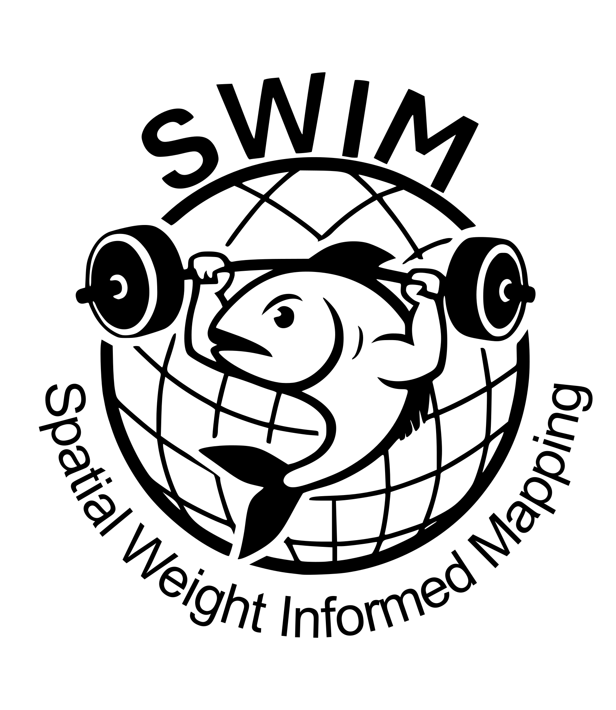

<!-- README.md is generated from README.Rmd. Please edit that file -->

```{r, include = FALSE}
knitr::opts_chunk$set(
  collapse = TRUE,
  comment = "#>",
  fig.path = "man/figures/README-",
  out.width = "100%"
)
```

# SWIM <a href="https://jolenesutton.github.io/swim/"></a>


<!-- badges: start -->
<!-- badges: end -->

Functions for **Spatial Weight Informed Mapping (SWIM)**, which enables integration of data from incongruent sources to generate a heterogeneous layer of sampling weights. Events missing geographic coordinates are assigned to a spatial grid using a probability-based framework informed by the sampling weights (i.e., sampling probabilities are proportional to assigned weights).

## Installation

You can install **SWIM** with:

``` r
# install.packages("devtools")
devtools::install_github("JoleneSutton/swim")
```
