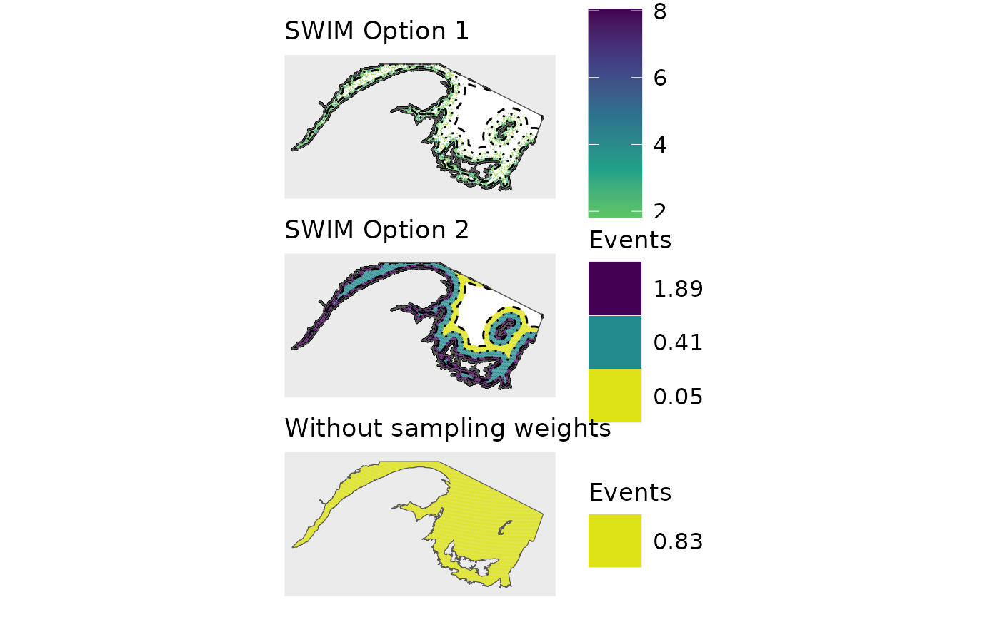

# Figure 2

## Overview

This vignette replicates Figure 2 in \[\].

``` r
library(swim)
library(ggplot2)
library(terra)
library(tidyterra)
library(patchwork)
```

## Assign events to spatial grid cells.

The example data file `sampling.weights` contains a column of spatial
grid cell identities and a column of sampling weights according to
distance buffers.

``` r
head(sampling.weights)
#>   OBJECTID weight
#> 1   255891      1
#> 2   256996      1
#> 3   256997      1
#> 4   256999      1
#> 5   258104      1
#> 6   258105      1
```

Use function `sw_sample` to assign 10,000 events to spatial grid cells.

``` r
set.seed(12345)

len=10000

x1<-sw_sample(len,sampling.weights,option=1)#Option 1 = based on weighted random sampling
#> Returning grid cell identities resulting from weighted random sampling

x2<-sw_sample(len,sampling.weights,option=2)#Option 2 = distribute over ALL grid cells according to weight
#> Returning data frame of the sampling weight, the number of associated spatial grid cells, and the number of events per grid cell

x3<-sw_sample(len,sampling.weights,option=3)#Option 3 = distribute over ALL grid cells evenly
#> Returning data frame of number grid cells and the number of events per grid cell
```

Compare outputs from the three options.

``` r
head(x1)
#> [1] 351939 347278 332847 273856 335121 268184

x2
#>   weight cells n.per.cell
#> 1      0  2394 0.00000000
#> 2   0.01  1903 0.04530052
#> 3   0.15  3172 0.40766187
#> 4      1  4553 1.89340867

x3
#>   cells n.per.cell
#> 1 12022  0.8318084
```

## Get example shapefiles for plotting

``` r
shapes<-sw_internal_shapefiles('all')
str(shapes)
#> List of 7
#>  $ naf4t           :S4 class 'SpatVector' [package "terra"]
#>  $ spatial.grid    :S4 class 'SpatVector' [package "terra"]
#>  $ buffer10        :S4 class 'SpatVector' [package "terra"]
#>  $ buffer30        :S4 class 'SpatVector' [package "terra"]
#>  $ buffer50        :S4 class 'SpatVector' [package "terra"]
#>  $ ref.grid        :S4 class 'SpatVector' [package "terra"]
#>  $ coastline.coarse:S4 class 'SpatVector' [package "terra"]

for(i in 3:5){
  shapes[[i]]<-crop(shapes[[i]],shapes[[1]])
}
```

## Plot 1

``` r
#tally per hex
x1b<-cbind.data.frame(table(x1))
names(x1b)<-c('OBJECTID','count') #use same grid cell identity column header as shapefile
head(x1b)
#>   OBJECTID count
#> 1   256996     3
#> 2   256997     2
#> 3   256999     2
#> 4   258104     3
#> 5   258105     3
#> 6   258106     2

grid.1b<-merge(shapes[[2]],x1b)

pl1<-ggplot()+
    geom_spatvector(data=shapes[[1]],fill='white')+
    geom_spatvector(data=grid.1b,aes(fill=count),col=NA)+
    geom_spatvector(data=shapes[[3]],fill=NA,col='black',linewidth=0.5,linetype=4)+
    geom_spatvector(data=shapes[[4]],fill=NA,col='black',linewidth=0.5,linetype=3)+
    geom_spatvector(data=shapes[[5]],fill=NA,col='black',linewidth=0.5,linetype=2)+
    scale_fill_viridis_c(name='Events',option='viridis',direction=-1,
                         limits=c(0.01,8.05),
                         begin = 0,end = 0.95)+
    geom_spatvector(data=shapes[[1]],fill=NA)
```

## Plot 2

``` r
names(x2)[3]<-'count'
grid.2<-merge(shapes[[2]],x2)
grid.2<-grid.2[which(grid.2$count>0),]
label2<-rev(round(unique(grid.2$count),2))

pl2<-ggplot()+
    geom_spatvector(data=shapes[[1]],fill='white')+
    geom_spatvector(data=grid.2,aes(fill=factor(count)),col=NA)+
    scale_fill_viridis_d(name='Events',option='viridis',direction=-1,
                         labels=label2,
                         begin = 0,end = 0.95)+
    guides(fill = guide_legend(reverse = TRUE))+
    geom_spatvector(data=shapes[[3]],fill=NA,col='black',linewidth=0.5,linetype=4)+
    geom_spatvector(data=shapes[[4]],fill=NA,col='black',linewidth=0.5,linetype=3)+
    geom_spatvector(data=shapes[[5]],fill=NA,col='black',linewidth=0.5,linetype=2)+
    geom_spatvector(data=shapes[[1]],fill=NA)
```

## Plot 3

``` r
x3
#>   cells n.per.cell
#> 1 12022  0.8318084
grid.3<-shapes[[2]]
grid.3$count<-x3[,2]

label3<-round(unique(grid.3$count),2)

pl3<-ggplot()+
    geom_spatvector(data=grid.3,aes(fill=factor(count)),col=NA)+
    scale_fill_viridis_d(name='Events',option='viridis',direction=-1,
                         begin = 0,end = 0.95,
                         label=label3)+
    geom_spatvector(data=shapes[[1]],fill=NA)
```

## Combine

Set up

``` r
CRS<-'epsg:4269'

map.theme<-list(coord_sf(crs=CRS,xlim=c(-71,-60),ylim=c(45.55,49.5)),
                theme(panel.grid.major = element_blank(),
                      panel.grid.minor = element_blank(),
                      axis.text = element_blank(),  # Remove axis text
                      axis.ticks = element_blank(), # Remove axis ticks
                      axis.title = element_blank()  # Remove axis titles
                ),
                theme(
                  legend.title = element_text(size = 13),
                  legend.position = "right",
                  legend.text = element_text(size = 12),
                  legend.key.size = unit(1, "cm"),
                  legend.justification = "left",
                  legend.box.margin = margin(l = 0.05, unit = "cm")   ))
```

Plot

``` r
(big.plot<-(pl1+map.theme+ggtitle('SWIM Option 1'))/(pl2+map.theme+ggtitle("SWIM Option 2"))/pl3+map.theme+ggtitle("Without sampling weights"))
```


